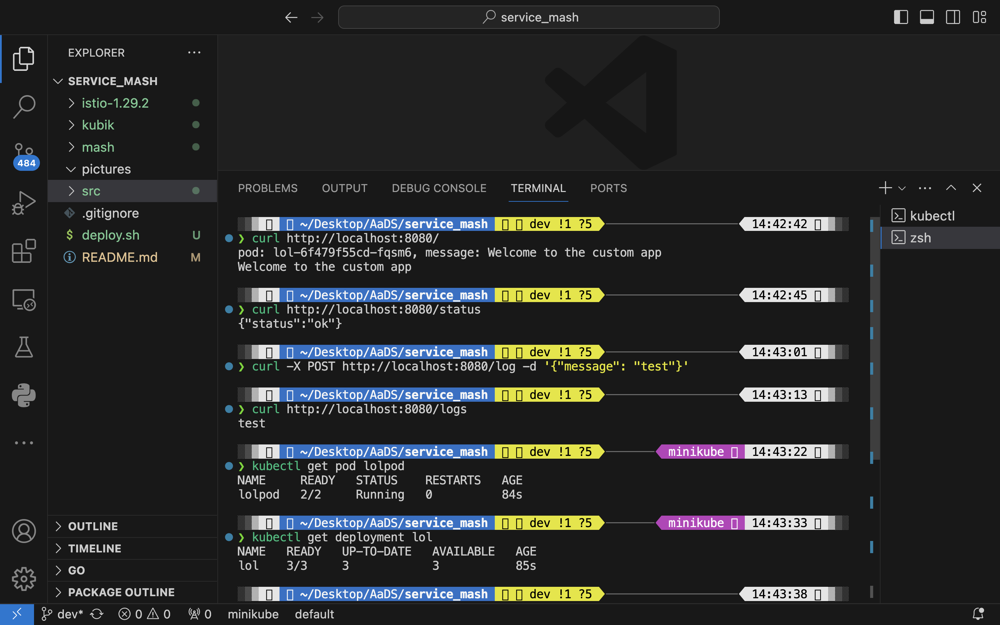
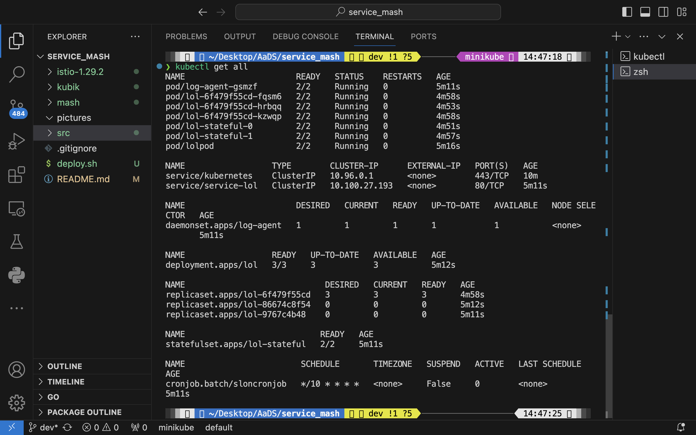
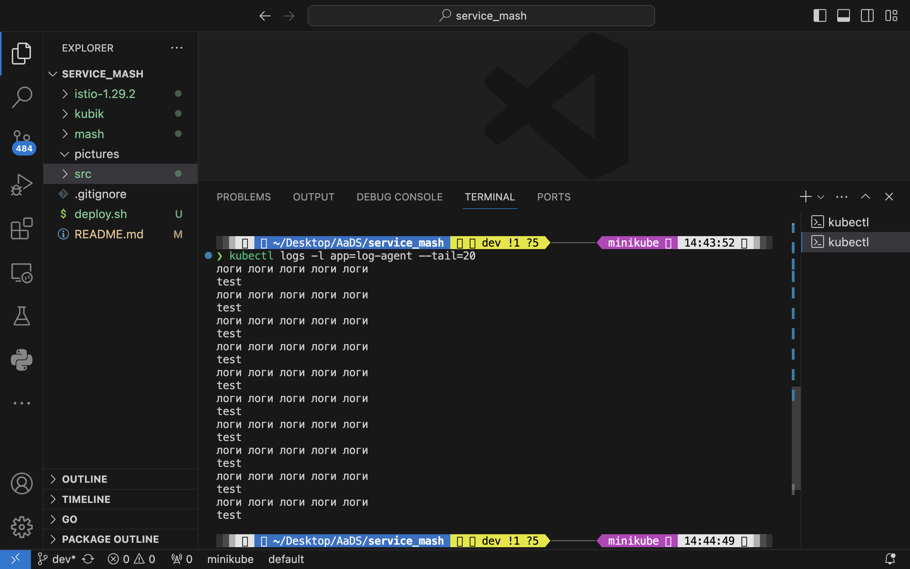
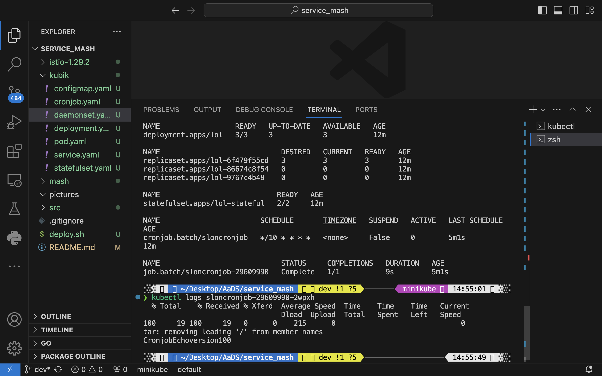
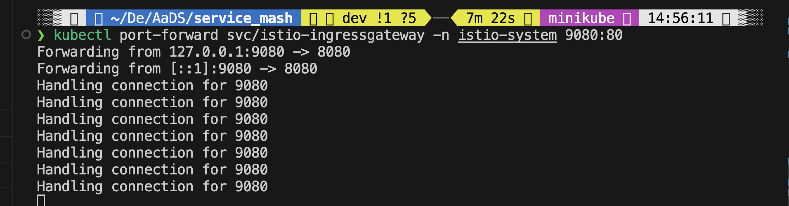
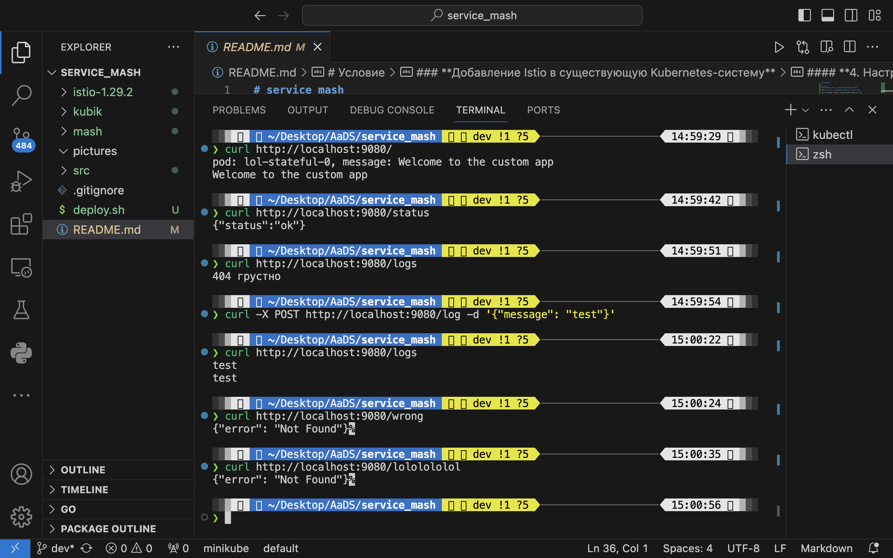
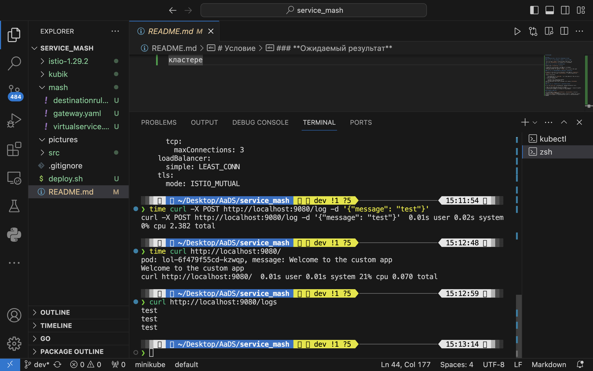
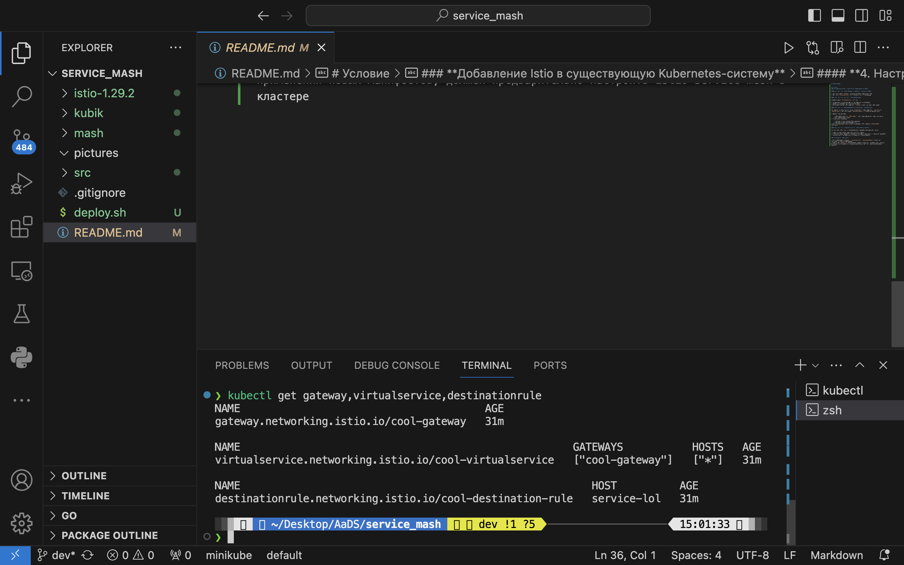
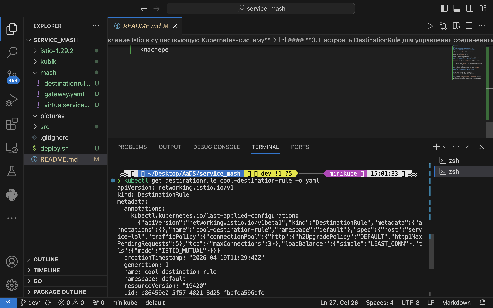

# service_mash

Гайд по запуску

```
minikube start
```

```
chmod +x deploy.sh
```

```
./deploy.sh
```

```
kubectl port-forward service/service-lol 8080:80
```
```
curl localhost:8080/logs

curl localhost:8080/

curl -X POST localhost:8080/log -d '{"message":"hello world"}'
```

для istio

```
kubectl port-forward svc/istio-ingressgateway -n istio-system 9080:80
```
```
curl localhost:9080/logs

curl localhost:9080/

curl -X POST localhost:9080/log -d '{"message":"hello world"}'
```


## Часть с дз1







## Часть с дз2








# Условие
### **Добавление Istio в существующую Kubernetes-систему**

#### **1. Настроить Istio Gateway и обеспечить внешний доступ**

* Настройте объект `Gateway`, принимающий HTTP-трафик на порт 80.
* Настройте `VirtualService`, который подключён к этому Gateway.

#### **2. Настроить маршруты в VirtualService**

Создайте объект `VirtualService`, который:

* Обрабатывает все внешние запросы, поступающие через Gateway.
* Делает маршрутизацию на основное приложение
* Все неизвестные маршруты (например, `/wrong`) должны возвращать 404 ошибку

#### **3. Настроить DestinationRule для управления соединениями**

Для каждого сервиса, на который маршрутизируется трафик (например, `app-service`, `log-service`), настройте объект `DestinationRule` со следующими параметрами:

* Балансировка нагрузки:

    * используйте алгоритм `LEAST_CONN`, чтобы трафик направлялся туда, где меньше всего текущих подключений.
* Ограничение соединений:

    * максимум 3 одновременных TCP-соединений
    * максимум 5 ожидающих HTTP-запросов
* Включите защищённую межсервисную коммуникацию внутри mesh-а (`ISTIO_MUTUAL` TLS-режим)

#### **4. Настроить отказоустойчивость и политику доставки**

Для маршрута `POST /log` (в VirtualService) реализуйте поведение при сбоях:

* Добавьте искусственную задержку ответа — 2 секунды.
* Установите общий таймаут — 1 секунда (чтобы запрос завершался с ошибкой по таймауту).
* Разрешите повторные попытки — до 2 попыток в случае неудачи.

### **Ожидаемый результат**

* Все конфигурации (`Gateway`, `VirtualService`, `DestinationRule`) должны быть оформлены в отдельных YAML-файлах.
* bash-скрипт `deploy.sh` из предыдущего задания должен быть модифицирован и, помимо, применения новых манифестов, должен предварительно настроить istio service mesh в кластере